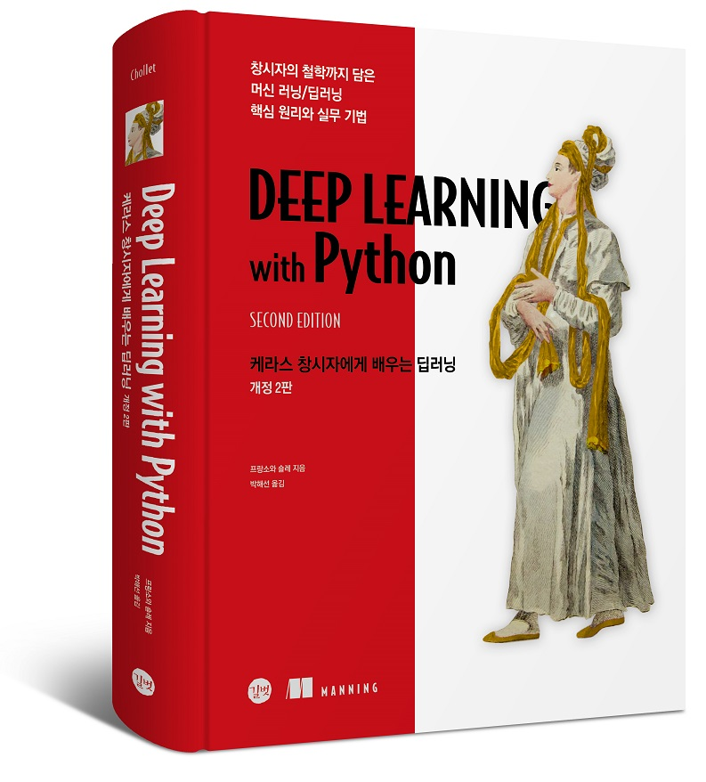

# 케라스 창시자에게 배우는 딥러닝 2판

이 저장소는 <[케라스 창시자에게 배우는 딥러닝 2판](https://tensorflow.blog/kerasdl2/)> 책의 주피터 노트북을 담고 있습니다. 이 책은 케라스(Keras) 라이브러리의 창시자이고 현재 구글의 소프트웨어 엔지니어인 프랑소와 숄레(François Chollet)가 쓴 <Deep Learning with Python 2nd Edition>의 번역서입니다. 번역서는 628페이지, 풀 컬러, 양장으로 제작되었습니다.

* 교보문고 https://bit.ly/3dv256v
* 예스24 https://bit.ly/3QP05oe
* 알라딘 https://bit.ly/3QrGCKt
* 매닝북 https://livebook.manning.com/book/deep-learning-with-python-second-edition/

각 목차에 해당하는 노트북은 다음을 참고하세요.

* 2장 [신경망의 수학적 구성 요소](chapter02_mathematical-building-blocks.ipynb)
* 3장 [케라스와 텐서플로 소개](chapter03_introduction-to-keras-and-tf.ipynb)
* 4장 [신경망 시작하기: 분류와 회귀](chapter04_getting-started-with-neural-networks.ipynb)
* 5장 [머신 러닝의 기본 요소](chapter05_fundamentals-of-ml.ipynb)
* 7장 [케라스 완전 정복](chapter07_working-with-keras.ipynb)
* 8장 [컴퓨터 비전을 위한 딥러닝](chapter08_intro-to-dl-for-computer-vision.ipynb)
* 9장 컴퓨터 비전을 위한 고급 딥러닝
  * 9.2 [이미지 분할 예제](chapter09_part01_image-segmentation.ipynb)
  * 9.3 [최신 컨브넷 아키텍처 패턴](chapter09_part02_modern-convnet-architecture-patterns.ipynb)
  * 9.4 [컨브넷이 학습한 것 해석하기](chapter09_part03_interpreting-what-convnets-learn.ipynb)
* 10장 [시계열을 위한 딥러닝](chapter10_dl-for-timeseries.ipynb)
* 11장 텍스트를 위한 딥러닝
  * 11.2, 11.3 [텍스트 데이터 준비, 단어 그룹을 표현하는 두 가지 방법: 집합과 시퀀스](chapter11_part01_introduction.ipynb)
  * 11.3.3 [단어를 시퀀스로 처리하기: 시퀀스 모델 방식](chapter11_part02_sequence-models.ipynb)
  * 11.4 [트랜스포머 아키텍처](chapter11_part03_transformer.ipynb)
  * 11.5 [텍스트 분류를 넘어: 시퀀스-투-시퀀스 학습](chapter11_part04_sequence-to-sequence-learning.ipynb)
* 12장 생성 모델을 위한 딥러닝
  * 12.1 [텍스트 생성](chapter12_part01_text-generation.ipynb)
  * 12.2 [딥드림](chapter12_part02_deep-dream.ipynb)
  * 12.3 [뉴럴 스타일 트랜스퍼](chapter12_part03_neural-style-transfer.ipynb)
  * 12.4 [변이형 오토인코더를 사용한 이미지 생성](chapter12_part04_variational-autoencoders.ipynb)
  * 12.5 [생성적 적대 신경망 소개](chapter12_part05_gans.ipynb)
* 13장 [실전 문제 해결을 위한 모범 사례](chapter13_best-practices-for-the-real-world.ipynb)
* 14장 [결론](chapter14_conclusions.ipynb)
